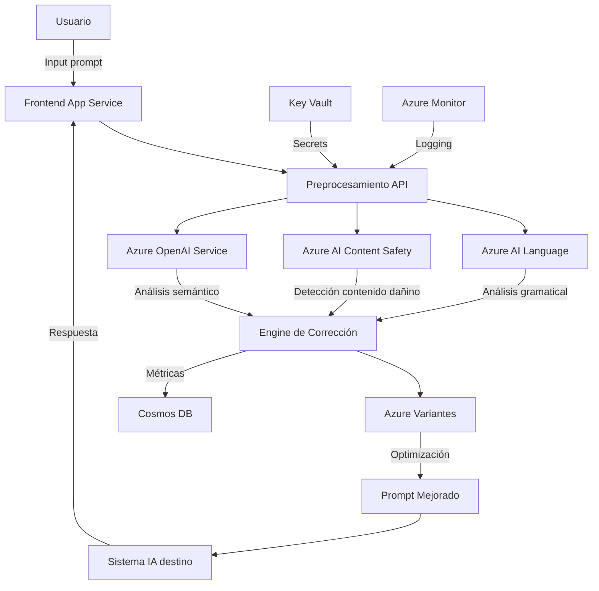

# **Azure Prompt Guardian**  


*A secure and intelligent prompt management system using Azure services.*

## **Introduction**
Azure Prompt Guardian is designed to securely manage, analyze, and optimize prompts used in AI applications. It leverages Azure's cloud capabilities to ensure scalability, security, and efficiency. The system identifies and corrects grammatical errors, incomplete queries, and unclear inputs while flagging harmful or sensitive language. It also enhances prompt clarity and precision to improve AI output quality.

## **Problem Statement**
AI-generated responses depend heavily on the quality of input prompts. Poorly structured, biased, or harmful prompts can lead to misleading AI outputs. The challenge is to implement a **prompt pre-processing layer** that:
- Identifies and corrects grammatical errors and unclear inputs.
- Flags harmful, biased, or sensitive language and suggests ethical alternatives.
- Enhances the clarity and precision of prompts to improve AI-generated responses.

## **Solution Overview**
Azure Prompt Guardian auto-corrects and validates user inputs before they are processed by an AI model. It ensures that prompts are optimized, compliant, and free of potential risks such as bias, harmful language, or sensitive data. The system leverages multiple Azure services to provide an end-to-end solution for prompt validation and enhancement.

## **Architecture**



### **Key Components:**
- **Azure Cosmos DB** 
- **Azure Static Web Apps** 
- **Azure Content Safety** 
- **Azure AI Language Services** 
- **Azure OpenAI** 
- **Azure Key Vault** 
- **Azure AI Services** 

## **Features**

- **Secure and Scalable**: Leverages Azure Key Vault for security and Cosmos DB for scalable storage.
**AI powered Prompt Optimization**: Enhances prompt structure and intent for better AI-generated responses.
- **Harm Content Identifier**: Detects and flags harmful or sensitive language.
- **Sentiment Analysis**: Evaluates the sentiment and intent behind user prompts.
- **Grammar and Clarity Enhancement**: Auto-corrects grammar and spelling errors, refines user prompts to improve AI response quality.
- **Personal Data Identification**: Detects and hides sensitive user information.
- **Text Content Analysis & Harm Category Classification**: Categorizes text based on its potential risks.
- **Responsible AI Level Indicator**: Assesses and scores the responsibility level of AI-generated content.
- **Audit and Responsibility Verification**: Tracks and verifies compliance with responsible AI guidelines.
- **Dashboard Analytics**: Provides analytics on prompt quality and safety.
- **Secure and Scalable**: Leverages Azure Key Vault for security and Cosmos DB for scalable storage.

#### Prompt Optimizing 


#### Harm Content Flagging 


## **Tech Stack**

### **Frontend:**
- **Framework:** Vite + TypeScript + Vue.js 
- **Styling:** Tailwind CSS, PostCSS
- **Hosting:** Azure Static Web Apps

### **Backend:**
- **Framework:** FastAPI (Python)
- **Database:** Azure Cosmos DB
- **Security & Compliance:** Azure Content Safety, Azure Key Vault
- **AI Services:** Azure AI Language, Azure OpenAI, Azure AI Services

### **Infrastructure & DevOps:**
- **Version Control:** Git 
- **Deployment:** Azure Services (Functions, Static Web Apps, Cosmos DB, AI Services)

## **Setup and Installation**
Before setting up the project, ensure you have the following installed:

- **Node.js (LTS version)** – Required for frontend development.
- **npm or yarn** – For managing frontend dependencies.
- **Python 3.9+** – Required for running the backend.
- **pip** – Python package manager.
- **Azure CLI** – For managing Azure resources.
- **VS Code or any IDE** – For development.
- **Git** – For version control.
- **Azure Subscription** – Required to deploy and configure Azure services.

1. **Clone the repository:**
   ```sh
   git clone https://github.com/ai-product-manager/AzurePromptGuardian
   cd azure-prompt-guardian
   ```
2. **Install dependencies:**
   ```sh
   pip install -r requirements.txtgit rm backend/main3.py
   ```
3. **Set up environment variables:**
   - Create an `.env` file and configure Azure credentials.
4. **Run the application:**
   ```sh
   python main.py
   ```


